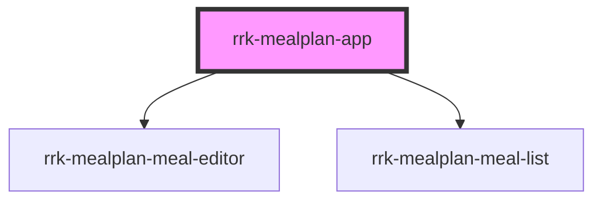

# rrk-mealplan-app

<!-- Auto Generated Below -->

## Properties

| Property      | Attribute      | Description | Type     | Default     |
| ------------- | -------------- | ----------- | -------- | ----------- |
| `ambulanceId` | `ambulance-id` |             | `string` | `undefined` |
| `apiBase`     | `api-base`     |             | `string` | `undefined` |
| `basePath`    | `base-path`    |             | `string` | `''`        |
| `counter`     | `counter`      |             | `number` | `0`         |

## Dependencies

### Depends on

- [rrk-mealplan-meal-editor](../rrk-mealplan-meal-editor)
- [rrk-mealplan-meal-list](../rrk-mealplan-meal-list)

### Graph

----------------------------------------------

*Built with [StencilJS](https://stenciljs.com/)*
