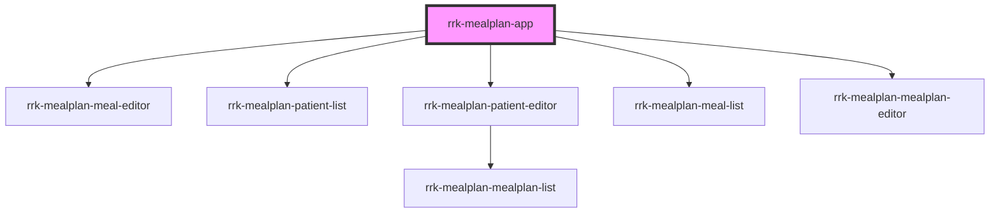

# rrk-mealplan-app

<!-- Auto Generated Below -->

## Properties

| Property   | Attribute   | Description | Type     | Default     |
| ---------- | ----------- | ----------- | -------- | ----------- |
| `apiBase`  | `api-base`  |             | `string` | `undefined` |
| `basePath` | `base-path` |             | `string` | `''`        |

## Dependencies

### Depends on

- [rrk-mealplan-meal-editor](../rrk-mealplan-meal-editor)
- [rrk-mealplan-patient-list](../rrk-mealplan-patient-list)
- [rrk-mealplan-patient-editor](../rrk-mealplan-patient-editor)
- [rrk-mealplan-meal-list](../rrk-mealplan-meal-list)
- [rrk-mealplan-mealplan-editor](../rrk-mealplan-mealplan-editor)

### Graph

----------------------------------------------

*Built with [StencilJS](https://stenciljs.com/)*
